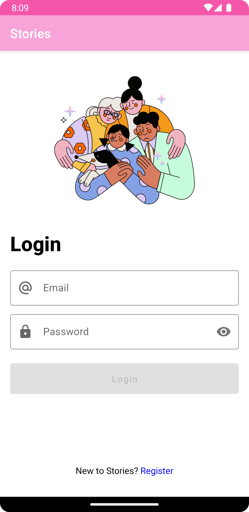
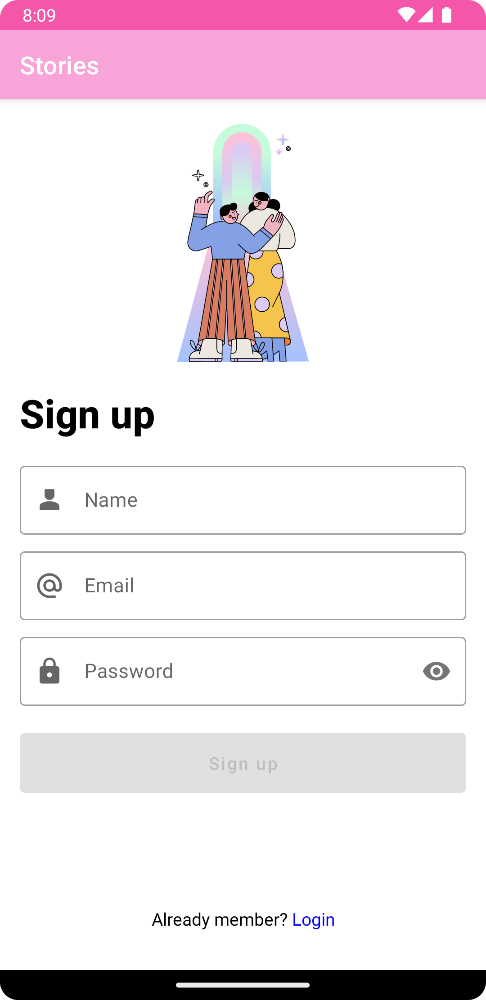
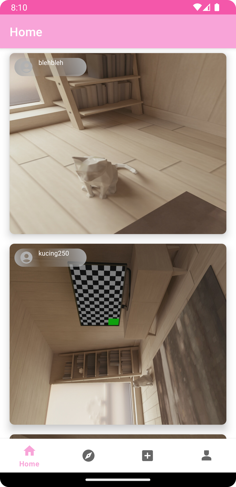
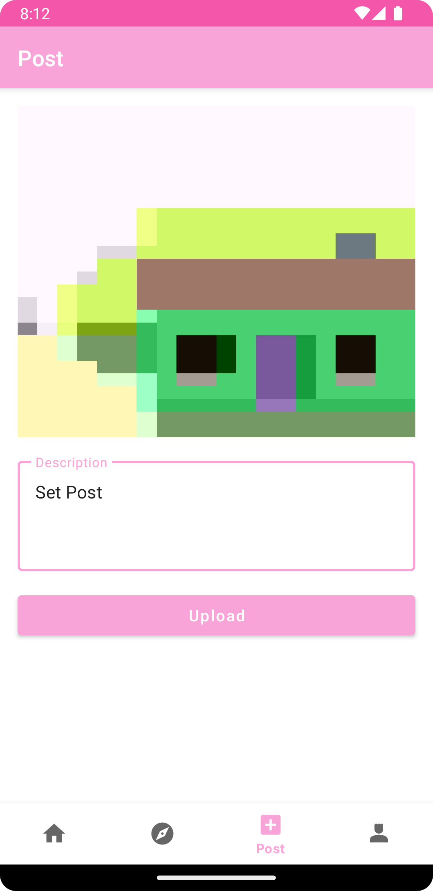
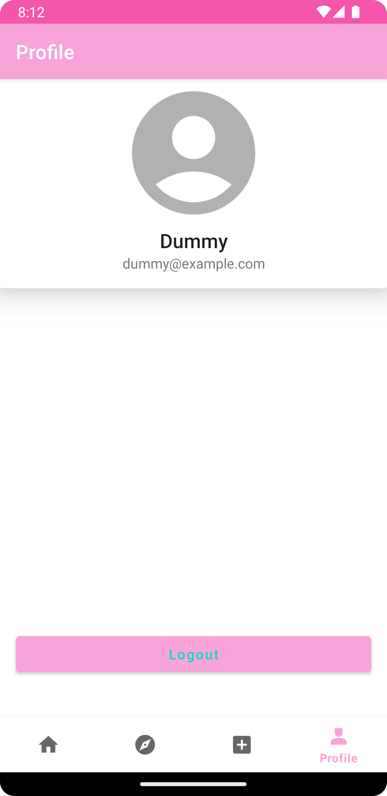
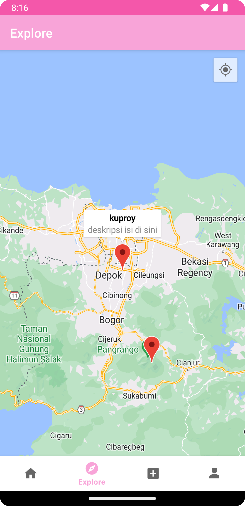
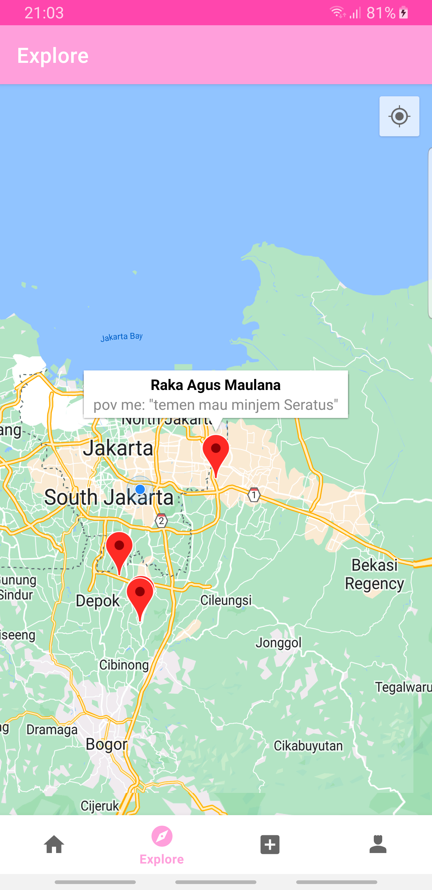

Introduction
============
Stories. Capture your memories!

Screenshoot
===========

Google Map Things
-----------------
Make sure you guys has been created the key & enable Google Map API Key SDK for
Android [Google Cloud Console ](https://console.cloud.google.com/apis/credentials)

One more thing, you should get SHA-1 for development or debug using this line on your terminal or
cmd:

    keytool -list -v -keystore ~/.android/debug.keystore -alias androiddebugkey -storepass android -keypass android

for windows using this line

    keytool -list -v -keystore "%USERPROFILE%\.android\debug.keystore" -alias androiddebugkey -storepass android -keypass android

Put that fingerprint package & SHA-1 on Google Cloud Console
SHA-1 : 6C:23:6F:4E:1A:DF:B0:B9:76xxxxxx
Package : com.raytalktech.storyapp

After you put them, you need to add Google Map API Key like :
AIzaSyDALH-xxxxx
on the Manifest

and violaa... pinjem dulu seratus

